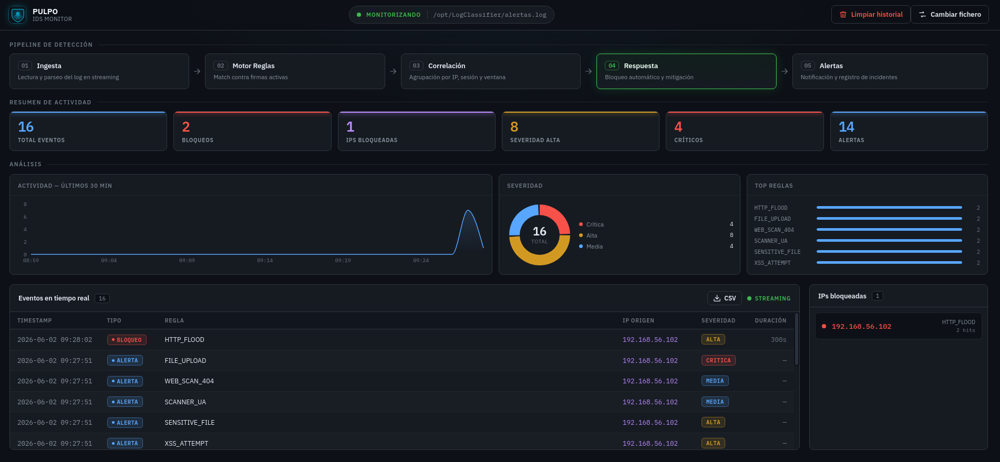

<p align="center">
  
</p>

<p align="center">
  
</p>

<p align="center"><b>IDS / IPS Monitor</b></p>

<p align="center">
  
  
  
  
  
  
</p>

---

> [!NOTE]
> **PULPO** es una aplicación de escritorio IDS/IPS desarrollada de forma independiente, inspirada conceptualmente en [LogClassifier](https://github.com/1van106/LogClassifier). Incorpora su propio pipeline de detección, procesamiento de logs en streaming, clasificación de alertas por tipo y severidad, persistencia de historial entre sesiones y visualización de la actividad mediante gráficos de análisis — todo dentro de un ejecutable único sin dependencias de servidor.

---



---

## Características

- **Streaming en tiempo real** — lee `alertas.log` con `fs.watch` de forma incremental; solo procesa bytes nuevos
- **Auto-carga al iniciar** — detecta automáticamente la ruta del log (`/opt/LogClassifier/alertas.log`) sin intervención del usuario
- **Persistencia de historial** — las alertas se almacenan en disco (`alerts.ndjson`); al reabrir la app el historial se recupera instantáneamente sin necesidad de que el IDS esté corriendo
- **Panel de análisis** — timeline de actividad de los últimos 30 min, gráfico de distribución por severidad y top de reglas más disparadas
- **Feed de alertas** — tabla en vivo con tipo, regla, IP, severidad y timestamp; filas nuevas con flash de color
- **Exportar a CSV** — descarga todas las alertas visibles como fichero `.csv` con un clic
- **Panel de IPs bloqueadas** — agrupa hits por IP con la regla que los disparó y contador de ocurrencias
- **Estadísticas** — tarjetas de resumen con total, bloqueos, alertas y desglose por severidad
- **Vista pipeline** — representación visual del pipeline de 5 etapas del IDS
- **Limpiar historial** — elimina alertas del dashboard y de la base de datos local
- **Ejecutable único** — sin dependencias de servidor; todo corre dentro del proceso Electron
- **Multiplataforma** — AppImage / .deb para Linux, instalador NSIS para Windows

---

## Arquitectura

```
Pipeline IDS (Python)            PULPO Dashboard
+------------------+             +------------------------------+
|  alertas.log     |  fs.watch   |  Main Process (Node.js)      |
|  (generado por   | ----------> |  watchLogFile()              |
|   el módulo IDS) |             |  tryAppendAlert() → store    |
+------------------+             |  IPC: alert:new              |
                                 +------------------------------+
                                             |
                                      contextBridge
                                             |
                                 +------------------------------+
                                 |  Renderer (React + Vite)     |
                                 |  useAlerts() hook            |
                                 |  → Alert[]       (streaming) |
                                 |  → BlockedIP[]   (derivado)  |
                                 |  → AppStats      (derivado)  |
                                 |  → chartData     (derivado)  |
                                 +------------------------------+
                                             |
                                 +------------------------------+
                                 |  Persistencia (Main)         |
                                 |  alerts.ndjson               |
                                 |  (userData de Electron)      |
                                 +------------------------------+
```

### Flujo IPC

| Canal | Dirección | Descripción |
|---|---|---|
| `dialog:openLog` | Renderer → Main | Abre diálogo nativo para seleccionar el `.log` |
| `log:watch` | Renderer → Main | Registra un fichero para monitorización |
| `log:getAutoPath` | Renderer → Main | Detecta la ruta del log automáticamente |
| `alert:new` | Main → Renderer | Envía una línea nueva del log al renderer |
| `db:getAlerts` | Renderer → Main | Carga el historial completo desde disco |
| `db:clear` | Renderer → Main | Borra el historial de alertas |

---

## Formato de alertas

El dashboard espera líneas con este formato (el mismo que genera LogClassifier):

```
[2026-02-25 10:15:32] BLOQUEO | Regla: SSH_BRUTEFORCE | IP: 192.168.1.100 | Severidad: ALTA | Duración: 300s
[2026-02-25 10:16:01] ALERTA  | Regla: XSS_ATTEMPT    | IP: 10.0.0.55     | Severidad: ALTA
[2026-02-25 10:16:45] REGISTRO| Regla: HTTP_METHOD_ABUSE | IP: 172.16.0.8  | Severidad: MEDIA
```

**Tipos de alerta:** `BLOQUEO` · `ALERTA` · `REGISTRO`  
**Severidades:** `CRITICA` · `ALTA` · `MEDIA` · `BAJA`

---

## Instalación y desarrollo

**Requisitos:** Node.js 18+ · npm 9+

```bash
# Clonar el repositorio
git clone https://github.com/1van106/PULPO__IDS-IPS.git
cd PULPO-IDS-IPS

# Instalar dependencias
npm install

# Arrancar en modo desarrollo (abre la ventana Electron directamente)
npm run dev
```

---

## Empaquetado

```bash
# Linux (.AppImage + .deb) — debe ejecutarse en Linux
npm run package:linux

# Windows (.exe instalador NSIS)
npm run package:win
```

Los ejecutables se generan en `dist/`.

---

## Estructura del proyecto

```
src/
├── main/
│   ├── index.ts          # Proceso principal: ventana, fs.watch, IPC handlers
│   └── store.ts          # Persistencia NDJSON: loadAlerts, tryAppendAlert, clearAlerts
├── preload/
│   ├── index.ts          # contextBridge → expone API segura al renderer
│   └── index.d.ts        # Tipos globales de window.api
└── renderer/src/
    ├── types.ts           # Alert, BlockedIP, AppStats, parseAlert()
    ├── hooks/
    │   └── useAlerts.ts   # Estado reactivo: alertas, IPs, stats, clearHistory
    └── components/
        ├── Dashboard.tsx  # Layout principal
        ├── Charts.tsx     # Timeline, donut de severidad, top reglas
        ├── AlertFeed.tsx  # Tabla de alertas en streaming + exportar CSV
        ├── BlockedIPs.tsx # Panel de IPs bloqueadas con hits
        ├── Stats.tsx      # Tarjetas de estadísticas
        ├── Pipeline.tsx   # Vista del pipeline IDS
        ├── Header.tsx     # Cabecera con estado, limpiar historial
        ├── Welcome.tsx    # Pantalla inicial (sin log cargado)
        └── Icons.tsx      # SVGs inline
```

---

## Stack tecnológico

| Herramienta | Versión | Uso |
|---|---|---|
|  **Electron** | 32 | Runtime de escritorio |
|  **React** | 18 | UI declarativa |
|  **TypeScript** | 5 | Tipado estático |
|  **Recharts** | 2 | Gráficos SVG (timeline, donut, barras) |
|  **electron-vite** | 2 | Build tool + HMR |
|  **electron-builder** | 25 | Empaquetado multiplataforma |

---

*PULPO · Proyecto personal · Inspirado en el concepto de [LogClassifier IDS](https://github.com/1van106/LogClassifier) · 2026*
