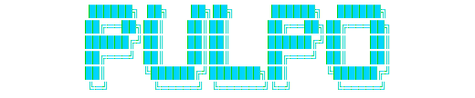
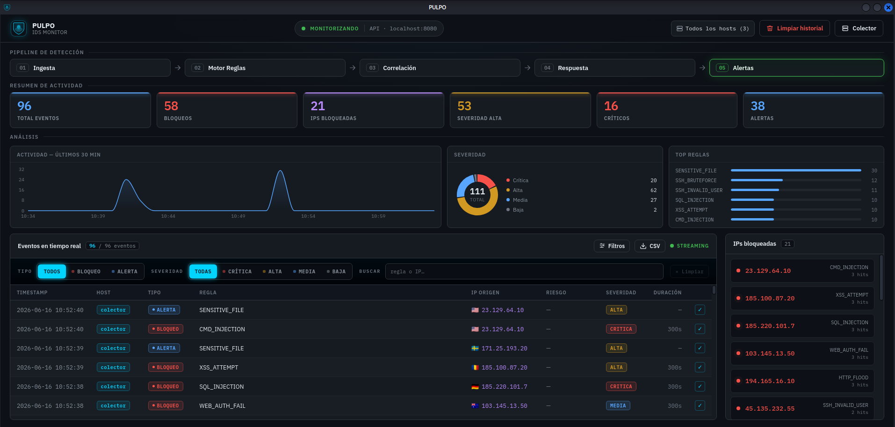

<p align="center">
  
</p>

<p align="center">
  
</p>

<p align="center"><b>Panel de control · IDS / IPS Monitor</b></p>

<p align="center">
  
  
  
  
  
  
</p>

---

> [!NOTE]
> Panel de control de escritorio de **PULPO**. Visualiza en tiempo real las alertas generadas por el [motor de detección](../engine): feed en vivo, IPs bloqueadas, gráficos de análisis y threat intelligence. Funciona en **dos modos**: leyendo el log local del motor, o conectándose por API al **colector** de un despliegue **multihost** (con selector de host). Todo dentro de un ejecutable único, sin dependencias de servidor.

---



---

## Características

| | |
|---|---|
| **Doble fuente de datos** | Modo **local** (lee `alertas.log` del motor) o modo **colector** (consume la API REST de un nodo central) |
| **Multihost** | Conexión a un colector configurable (URL + token); **selector de host** y columna de origen cuando hay varios sensores reportando |
| **Streaming en tiempo real** | Lee el log con `fs.watch` de forma incremental; solo procesa bytes nuevos |
| **Persistencia de historial** | Las alertas se guardan en disco (`alerts.ndjson`); el historial se recupera entre sesiones |
| **Feed de alertas** | Tabla en vivo con tipo, regla, IP (con bandera de país), riesgo, severidad y timestamp; filas nuevas con flash de color |
| **Threat intelligence** | Columna de riesgo con score de AbuseIPDB y detecciones de VirusTotal por IP, y país de origen vía GeoIP |
| **Panel de análisis** | Timeline de los últimos 30 min, distribución por severidad y top de reglas disparadas |
| **Barra de filtros** | Búsqueda y filtrado de la tabla de alertas |
| **Exportar a CSV** | Descarga las alertas visibles (incluye host, país, abuse_score, vt_malicious) con un clic |
| **Panel de IPs bloqueadas** | Agrupa hits por IP con la regla que los disparó y contador de ocurrencias |
| **Estadísticas** | Tarjetas de resumen con total, bloqueos, alertas y desglose por severidad |
| **Vista pipeline** | Representación visual del pipeline de 5 etapas del IDS |
| **Ejecutable único** | Sin dependencias de servidor; todo corre dentro del proceso Electron |
| **Multiplataforma** | AppImage / `.deb` para Linux · instalador NSIS para Windows |

---

## Modos de funcionamiento

```
  Modo LOCAL                              Modo COLECTOR (multihost)
  ┌────────────────────┐                  ┌──────────────────────────┐
  │ motor → alertas.log│   fs.watch       │  Colector  /api/alerts   │
  │ (un solo host)     │ ──────────────►  │  /api/hosts  /api/stats  │
  └────────────────────┘   Dashboard      └────────────┬─────────────┘
                                                        │ HTTP (+ token)
                                          ┌─────────────▼─────────────┐
                                          │ Dashboard · selector host │
                                          └───────────────────────────┘
```

- **Local**: el dashboard observa el `alertas.log` que escribe el motor en la misma máquina.
- **Colector**: se configura la URL (y token) del colector desde la cabecera; el dashboard consume su API REST y muestra el **selector de host** para filtrar por sensor. La columna *Host* aparece automáticamente cuando hay más de uno reportando.

---

## Arquitectura

```
Motor de detección (Python)        PULPO Dashboard
+------------------+               +------------------------------+
|  alertas.log     |   fs.watch    |  Main Process (Node.js)      |
|  / API colector  | ------------> |  watchLogFile() / fetch API  |
+------------------+               |  tryAppendAlert() → store    |
                                   |  IPC: alert:new              |
                                   +--------------+---------------+
                                                  | contextBridge
                                   +--------------v---------------+
                                   |  Renderer (React + Vite)     |
                                   |  useAlerts() hook            |
                                   |  → Alert[]       (streaming) |
                                   |  → BlockedIP[]   (derivado)  |
                                   |  → AppStats      (derivado)  |
                                   |  → chartData     (derivado)  |
                                   +--------------+---------------+
                                                  |
                                   +--------------v---------------+
                                   |  Persistencia · alerts.ndjson|
                                   |  (userData de Electron)      |
                                   +------------------------------+
```

### Flujo IPC

| Canal | Dirección | Descripción |
|---|---|---|
| `dialog:openLog` | Renderer → Main | Abre diálogo nativo para seleccionar el `.log` |
| `log:watch` | Renderer → Main | Registra un fichero para monitorización |
| `log:getAutoPath` | Renderer → Main | Detecta la ruta del log automáticamente |
| `alert:new` | Main → Renderer | Envía una línea nueva del log al renderer |
| `db:getAlerts` | Renderer → Main | Carga el historial completo desde disco |
| `db:clear` | Renderer → Main | Borra el historial de alertas |

---

## Formato de alertas

> [!TIP]
> El dashboard procesa las líneas que genera el motor con este formato:

```
[2026-02-25 10:15:32] BLOQUEO | Regla: SSH_BRUTEFORCE    | IP: 203.0.113.10  | Severidad: ALTA  | Duración: 300s
[2026-02-25 10:16:01] ALERTA  | Regla: XSS_ATTEMPT       | IP: 198.51.100.5  | Severidad: ALTA
[2026-02-25 10:16:45] REGISTRO| Regla: HTTP_METHOD_ABUSE | IP: 192.0.2.8     | Severidad: MEDIA
```

**Tipos:** `BLOQUEO` · `ALERTA` · `REGISTRO` &nbsp;|&nbsp; **Severidades:** `CRITICA` · `ALTA` · `MEDIA` · `BAJA`

---

## Instalación y desarrollo

> [!IMPORTANT]
> **Requisitos:** Node.js 18+ · npm 9+. El dashboard vive en la carpeta `dashboard/` del monorepo.

```bash
git clone https://github.com/1van106/PULPO__IDS-IPS.git
cd PULPO__IDS-IPS/dashboard
npm install
npm run dev        # abre la ventana Electron directamente
```

### Empaquetado

```bash
npm run package:linux   # AppImage + .deb  —  ejecutar en Linux
npm run package:win     # instalador NSIS para Windows
```

> Los ejecutables se generan en `dist/`

---

<details>
<summary><b>Estructura del proyecto</b></summary>
<br>

```
src/
├── main/
│   ├── index.ts          # Proceso principal: ventana, fs.watch / API, IPC handlers
│   └── store.ts          # Persistencia NDJSON: loadAlerts, tryAppendAlert, clearAlerts
├── preload/
│   ├── index.ts          # contextBridge → expone API segura al renderer
│   └── index.d.ts        # Tipos globales de window.api
└── renderer/src/
    ├── types.ts           # Alert, BlockedIP, AppStats, parseAlert()
    ├── hooks/
    │   └── useAlerts.ts   # Estado reactivo: alertas, IPs, stats, hosts
    └── components/
        ├── Dashboard.tsx  # Layout principal
        ├── Charts.tsx     # Timeline, donut de severidad, top reglas
        ├── AlertFeed.tsx  # Tabla de alertas en streaming + exportar CSV
        ├── BlockedIPs.tsx # Panel de IPs bloqueadas con hits
        ├── Stats.tsx      # Tarjetas de estadísticas
        ├── Pipeline.tsx   # Vista del pipeline IDS
        ├── Header.tsx     # Cabecera: estado, selector de host, ajustes del colector
        ├── Welcome.tsx    # Pantalla inicial (sin log cargado)
        └── Icons.tsx      # SVGs inline
```

</details>

---

## Stack tecnológico

| Herramienta | Versión | Uso |
|---|---|---|
|  | 32 | Runtime de escritorio |
|  | 18 | UI declarativa |
|  | 5 | Tipado estático |
|  | 2 | Gráficos SVG (timeline, donut, barras) |
|  | 5 | Build tool + HMR |
|  | 25 | Empaquetado multiplataforma |

---

<p align="center"><i>Panel de control de PULPO · El motor de detección está en <a href="../engine">engine/</a></i></p>
